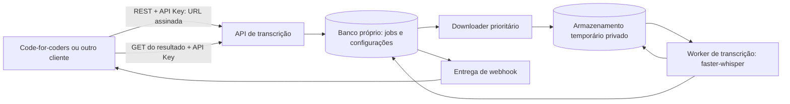

# Plano: API de transcrição assíncrona

## Objetivo

Transformar a prova de conceito do Whisper em um serviço independente que recebe áudio ou vídeo, processa a transcrição de forma assíncrona e entrega o resultado ao cliente por uma integração baseada em REST e webhook.

O serviço deve funcionar para diferentes clientes. O code-for-coders será o primeiro consumidor, sem transferir para o Whisper conceitos como curso ou aula.

## Premissas iniciais

- Duração máxima por arquivo: **2 horas**.
- Volume inicial: **até 10 jobs por dia**.
- Entrada inicial: **URL assinada de download do S3**.
- O download da mídia deve começar logo após a aceitação do job, sem aguardar a fila de transcrição.
- Idioma inicial: **português do Brasil (`pt-BR`)**.
- Retenção dos dados do job: **24 horas após o estado terminal**; a mídia pode ser apagada antes, assim que não for mais necessária.
- O limite máximo de tamanho em bytes ainda precisa ser definido; duração não determina o tamanho do arquivo.

## Responsabilidades

O serviço será responsável por:

- receber arquivos de áudio e vídeo ou uma URL de origem;
- autenticar e limitar o acesso dos clientes;
- enfileirar e processar transcrições;
- informar o estado do job e notificar sua conclusão;
- disponibilizar o resultado por tempo limitado;
- expurgar arquivos e resultados temporários;
- oferecer telas para acompanhar jobs e gerenciar API Keys.

O cliente será responsável por:

- decidir como apresentar legenda ou transcrição;
- guardar permanentemente a transcrição, se necessário;
- associar o resultado ao seu próprio conteúdo;
- indexar e oferecer busca textual.

## Arquitetura proposta

A API e os workers devem executar separadamente. A API valida a requisição, registra um job durável e responde sem aguardar a transcrição. Um componente de ingestão inicia logo o download da URL assinada e grava a mídia no espaço temporário do serviço. Depois do download, um worker carrega o modelo e processa o job de forma assíncrona.



O banco do serviço mantém o estado dos jobs e das configurações. Para a primeira versão, a própria tabela de jobs pode funcionar como fila durável, com lease, tentativas e recuperação de jobs abandonados. A etapa de download deve ter prioridade e capacidade própria, separada dos workers ocupados com transcrições de até duas horas. Esse padrão de trabalho durável é semelhante ao escolhido para o worker do domínio de mídia do code-for-coders na [ADR-0006](../../code-for-coders/docs/adr/0006-preparacao-de-video-e-custodia-de-chave.md).

O download deve começar logo após a criação do job, sem esperar a fila de transcrição. A API deve confirmar `202 Accepted` depois que o componente de ingestão assumir o job e iniciar a conexão de download; o prazo máximo para esse início ainda precisa ser definido. Após concluir o download, o processamento deixa de depender da URL assinada. Se a URL já estiver expirada ou o download falhar, o job termina com um erro específico de origem indisponível, sem iniciar a transcrição.

Com dez jobs diários de até duas horas, a carga máxima teórica é de **20 horas de mídia por dia**. A capacidade e o tamanho da fila dependem do fator de tempo real (RTF) medido nos benchmarks: é necessário validar se os workers conseguem processar esse volume e qual será o tempo de espera e conclusão esperado.

O serviço não compartilha o banco do code-for-coders. A integração ocorre por HTTP: o cliente envia a mídia ou sua URL, recebe o aviso de conclusão e decide como guardar e indexar o resultado.

## Contrato REST inicial

### Criar uma transcrição

`POST /v1/transcriptions` aceita inicialmente uma URL assinada de download, junto com opções e metadados genéricos. A resposta é `202 Accepted`, enviada depois que o download começar, e inclui um ID opaco, o estado inicial e uma URL de consulta.

Uma chave de idempotência deve permitir que o cliente repita a requisição sem criar jobs duplicados quando não recebe a primeira resposta.

### Consultar o estado

`GET /v1/transcriptions/{id}` informa o estado, os horários relevantes e, quando aplicável, dados resumidos do processamento. Os estados públicos podem começar com `downloading`, `queued`, `processing`, `completed` e `failed`.

### Receber o aviso e buscar o resultado

O webhook envia um evento pequeno de conclusão ou falha com ID do evento, ID do job, estado e referência opaca do cliente. O cliente busca o conteúdo em `GET /v1/transcriptions/{id}/result`, usando sua API Key.

O webhook deve ter assinatura verificável, retentativas com espera progressiva e entrega ao menos uma vez. O cliente deve poder deduplicar eventos pelo ID do evento. Falhas de entrega do webhook são acompanhadas separadamente do estado da transcrição.

Manter o conteúdo completo fora do webhook evita payloads grandes e facilita retentativas. O endpoint de resultado pode retornar JSON com streaming e compressão quando necessário.

### Formato do resultado

O resultado deve ser versionado e independente do motor de transcrição. Um formato inicial pode conter:

```json
{
  "schemaVersion": 1,
  "jobId": "id-opaco",
  "language": "pt-BR",
  "durationMs": 3600000,
  "segments": [
    { "startMs": 1240, "endMs": 4100, "text": "Exemplo de transcrição." }
  ]
}
```

Os tempos dos segmentos são relativos ao início do arquivo. O cliente pode usar a referência opaca enviada na criação para relacionar o job ao seu próprio conteúdo; a API não interpreta essa referência.

## Entrada de áudio e vídeo

O caminho inicial recebe uma URL assinada do S3. O serviço inicia o download assim que aceita o job e grava o arquivo no armazenamento temporário próprio. A fila de downloads não deve ficar atrás dos workers que fazem transcrição; assim, uma transcrição longa não impede o início de downloads novos.

A URL deve estar válida quando o serviço iniciar o GET; o cliente continua responsável por gerá-la com margem para o início e eventuais retentativas do download. O Whisper usa apenas a URL recebida e não precisa de credenciais do S3. Depois de concluir o download, a validade da URL deixa de afetar o job.

O serviço pode oferecer dois caminhos de entrada:

1. **URL de origem (inicial):** receber uma URL assinada de download, inicialmente do S3.
2. **Upload:** receber o arquivo diretamente ou fornecer uma URL temporária de upload para arquivos maiores, como evolução posterior.

Links de origem precisam continuar válidos enquanto o serviço obtém o arquivo. O serviço deve validar destinos, redirecionamentos, tamanho e tempo de download para impedir acesso a endereços internos e downloads sem limite.

Para links assinados do armazenamento do cliente, o Whisper deve baixar a mídia para seu espaço temporário. Ele não precisa receber credenciais nem conhecer o provedor de armazenamento do cliente.

## API Keys e dashboard

As API Keys pertencem a uma conta genérica do serviço. Cada chave deve ter escopos, data de criação, último uso, opção de revogação e rotação. O segredo é mostrado apenas uma vez e armazenado somente como hash. O console usa autenticação própria; API Keys são credenciais para chamadas de máquina.

O dashboard pode reunir:

- gerenciamento de API Keys;
- jobs recentes e seus estados;
- tamanho e idade da fila;
- tentativas e falhas de processamento;
- saúde dos workers;
- falhas e retentativas de webhook.

O painel não precisa exibir o conteúdo da mídia ou da transcrição para cumprir seu papel operacional.

## Dados temporários e expurgo

O armazenamento temporário existe para viabilizar o processamento e a entrega do resultado. Ele não é o armazenamento permanente da plataforma.

| Dado | Retenção proposta |
|---|---|
| Arquivo baixado | Apagar assim que não for mais necessário ao processamento e, no máximo, quando vencer a retenção de 24 horas após o estado terminal. |
| Resultado da transcrição | Manter por até 24 horas após o estado terminal, permitindo novas tentativas de busca durante esse período. |
| Metadados do job | Manter por até 24 horas após o estado terminal para consulta operacional, sem conteúdo da mídia ou da transcrição. |
| Logs e traces | Não incluir conteúdo, API Keys nem URLs assinadas. |

Um processo periódico deve remover dados expirados e detectar arquivos temporários órfãos. A retenção de 24 horas começa quando o job chega a um estado terminal (`completed` ou `failed`); o arquivo de origem pode ser removido antes, assim que não for mais necessário.

Há uma decisão de infraestrutura pendente para o armazenamento temporário. A [ADR-0002 do code-for-coders](../../code-for-coders/docs/adr/0002-plataforma-de-runtime-coolify.md) reserva o S3 da AWS para mídia. As opções iniciais são um volume temporário isolado, com limites de capacidade, ou uma decisão explícita para um armazenamento de objetos próprio do serviço. O bucket do domínio de mídia não deve ser reutilizado sem uma decisão arquitetural.

## Relação com a prova de conceito

A implementação atual já tem uma API FastAPI, um executor de transcrição e o adaptador `faster-whisper`. A API atual recebe um caminho local; o estado do job fica em memória; e os artefatos são gravados no diretório de saída. A transcrição fixa o idioma em português. O contrato inicial deve identificar o idioma como `pt-BR`, adaptando-o internamente ao formato aceito pelo motor.

O motor pode ser preservado como adaptador interno. A evolução principal é substituir a fila em memória por estado durável, separar API e worker, permitir upload ou URL, definir o contrato de resultado e automatizar entrega e expurgo.

## Etapas sugeridas

1. **Fechar o contrato:** endpoints, estados, formato do resultado, limite de 2 horas, limite em bytes e retenção de 24 horas.
2. **Construir o processamento durável:** banco próprio, API separada dos workers, início prioritário do download da URL assinada, fila recuperável e limite de até 10 jobs por dia.
3. **Entregar resultados com segurança:** API Keys, consulta de estado e resultado, webhook assinado, retentativas e idempotência.
4. **Criar o console:** telas de API Keys, fila e falhas de processamento e webhook.
5. **Integrar o primeiro cliente:** code-for-coders envia uma mídia ou URL e recebe o aviso; depois associa, armazena e indexa a transcrição sob suas próprias regras.

## Decisões a fechar

- Qual o tamanho máximo em bytes permitido para cada arquivo de até duas horas?
- Qual o pico esperado de jobs simultâneos e qual o prazo esperado para iniciar o download e concluir a transcrição?
- Qual validade mínima a URL assinada terá para permitir o download completo?
- O suporte a idiomas além de `pt-BR` fica para uma etapa posterior ou precisa entrar no primeiro corte?
