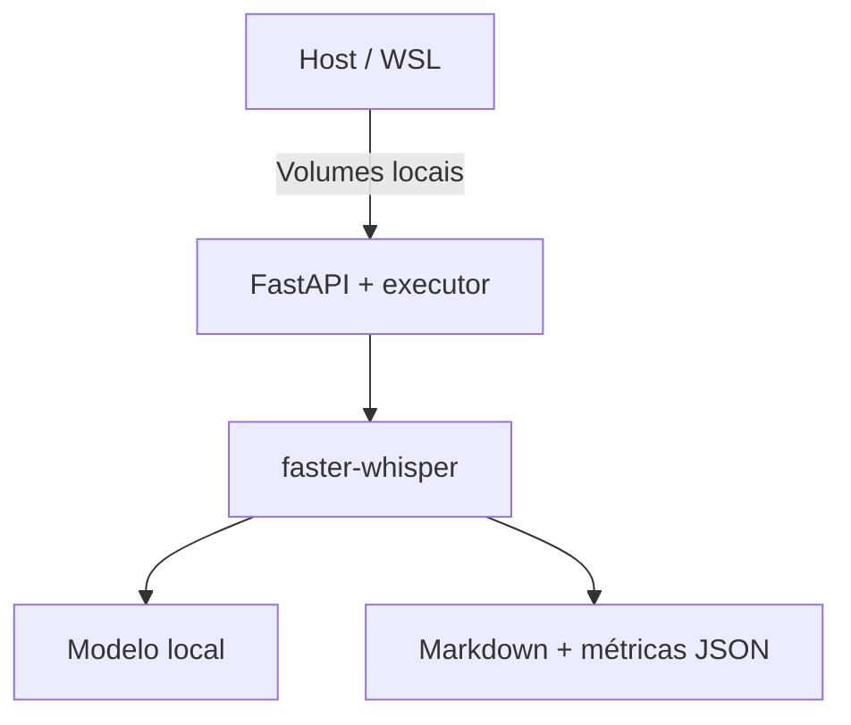
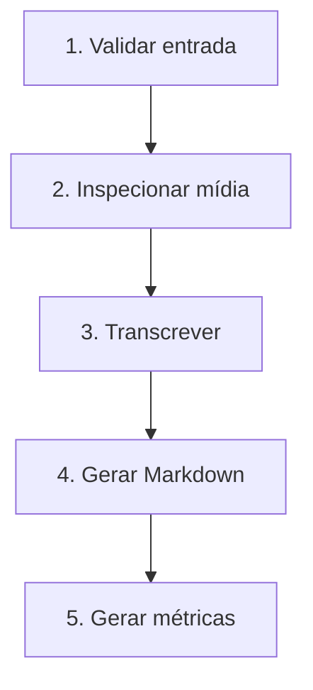

# POC de Transcrição Offline de Reuniões

**Versão:** 1.0  
**Data:** 25 de setembro de 2026  
**Status:** Plano de implementação  
**Objetivo:** validar a viabilidade de transcrever reuniões localmente, usando somente CPU, e gerar um arquivo Markdown com a transcrição e as métricas do processamento.

---

## 1. Resumo executivo

Esta prova de conceito deverá receber o caminho de um vídeo ou áudio armazenado localmente, executar a transcrição sem enviar dados para serviços externos e produzir:

- um arquivo Markdown com a transcrição e timestamps;
- um arquivo JSON com métricas de tempo, CPU, memória e velocidade de processamento.

A POC será intencionalmente pequena. A solução inicial utilizará:

| Componente | Escolha inicial |
|---|---|
| Runtime | Python |
| API | FastAPI |
| Motor de transcrição | `faster-whisper` |
| Modelo inicial | Whisper `medium` |
| Processamento | CPU com quantização `INT8` |
| Detecção de silêncio | Silero VAD integrado ao `faster-whisper` |
| Persistência | Filesystem local |
| Empacotamento | Docker Compose |
| Concorrência | Um processamento por vez |
| Saídas | Markdown e JSON |

Não haverá frontend, banco de dados, fila distribuída, diarização, identificação dos participantes ou sumarização por LLM nesta primeira etapa.

A decisão sobre GPU somente será tomada após o benchmark. Para um fluxo assíncrono e de baixo volume, CPU pode ser suficiente. A POC existe justamente para medir essa hipótese no hardware real.

---

## 2. Problema a resolver

Hoje existem várias reuniões gravadas cujo conteúdo precisa ser consultado posteriormente. Assistir novamente a vídeos longos é demorado, e o uso de serviços externos de transcrição pode ser incompatível com requisitos de privacidade ou confidencialidade.

A solução desejada deve permitir:

1. armazenar o vídeo localmente;
2. informar o caminho do arquivo;
3. processar a mídia localmente;
4. gerar uma transcrição pesquisável em Markdown;
5. medir o custo real de execução no equipamento disponível;
6. comprovar que o processamento pode ocorrer sem internet.

### Pergunta central da POC

> Com CPU apenas, quanto tempo, memória e processamento o hardware consome para transformar uma reunião real em uma transcrição de qualidade aceitável?

### Perguntas que deverão ser respondidas

- Quanto tempo leva para transcrever uma reunião de uma hora?
- Quanto de RAM é consumido durante o processamento?
- Quanto de CPU é utilizado?
- Quantos núcleos podem ser usados sem prejudicar o trabalho normal na máquina?
- Qual é o melhor equilíbrio entre os modelos `small`, `medium` e `large-v3`?
- A qualidade em português é aceitável?
- Como o modelo trata termos técnicos, siglas e nomes próprios?
- É possível continuar utilizando a máquina enquanto a transcrição ocorre?
- Existe justificativa real para adquirir ou dedicar uma GPU?

---

## 3. Por que Whisper

Whisper é adequado ao cenário porque:

- suporta transcrição multilíngue, incluindo português;
- pode ser executado localmente;
- trabalha com modelos de diferentes tamanhos;
- retorna segmentos com timestamps;
- não depende de uma API externa durante a inferência, desde que o modelo esteja disponível no disco.

O modelo `turbo` é uma versão otimizada do `large-v3`, com foco em maior velocidade e pequena perda de precisão. Entretanto, para a POC CPU-only, a comparação inicial será feita entre `small`, `medium` e `large-v3`, começando por `medium` como hipótese de melhor equilíbrio entre qualidade e custo.

### Por que `faster-whisper`

Para uma aplicação Python executada em container, `faster-whisper` oferece uma integração direta e recursos úteis para a POC:

- execução em CPU com `INT8`;
- configuração explícita do número de threads;
- timestamps por segmento e, opcionalmente, por palavra;
- Silero VAD integrado;
- carregamento de modelo a partir de um diretório local;
- decodificação de mídia por PyAV, sem exigir o executável FFmpeg no fluxo básico;
- uso do CTranslate2 como mecanismo de inferência.

`whisper.cpp` continua sendo uma alternativa relevante, principalmente para experimentos posteriores com Vulkan em hardware AMD. Ele não será incluído na primeira matriz para evitar misturar a comparação de modelos com a comparação de engines.

---

## 4. Hipóteses da POC

As hipóteses a validar são:

1. O modelo `medium`, em CPU com `INT8`, produz transcrição aceitável para reuniões em português.
2. Uma reunião de uma hora pode ser processada em tempo suficientemente menor que sua duração.
3. Limitar o container a quatro, seis ou oito CPUs permite encontrar um ponto em que a transcrição é rápida sem tornar a máquina desconfortável para uso simultâneo.
4. O processamento pode ocorrer completamente offline depois que imagem, dependências e modelos forem preparados.
5. O modelo `large-v3` pode melhorar a qualidade, mas talvez não o suficiente para justificar o aumento de tempo e memória.
6. O modelo `small` pode ser mais rápido, mas talvez erre termos técnicos em uma proporção inaceitável.
7. Uma GPU não será necessária para o volume pessoal inicialmente esperado.

Essas hipóteses não devem ser tratadas como conclusões antecipadas. O resultado será determinado pelas medições.

---

## 5. Escopo

### 5.1 Dentro do escopo

- execução local via Docker;
- API HTTP local;
- entrada por caminho relativo de arquivo;
- arquivos de vídeo e áudio em diretório controlado;
- processamento assíncrono;
- apenas um job em execução por vez;
- estados `queued`, `processing`, `completed` e `failed`;
- transcrição em português;
- timestamps por segmento;
- geração de Markdown;
- geração de métricas em JSON;
- modelos locais;
- limitação de CPU pelo Docker;
- benchmark com o mesmo arquivo e configurações controladas;
- teste de execução sem acesso à rede.

### 5.2 Fora do escopo

- upload pelo navegador;
- frontend;
- autenticação e autorização;
- banco de dados;
- Redis ou fila distribuída;
- execução concorrente de várias reuniões;
- diarização ou identificação de quem falou;
- associação de voz a nomes de pessoas;
- resumo automático por LLM;
- decisões, pendências e responsáveis extraídos automaticamente;
- busca semântica nas transcrições;
- edição da transcrição;
- SSE ou WebSocket;
- Kubernetes;
- armazenamento S3;
- execução em GPU;
- suporte operacional de produção.

---

## 6. Resultado esperado

### Entrada

```text
data/input/reuniao-arquitetura.mp4
```

### Saídas

```text
data/output/
├── reuniao-arquitetura.md
└── reuniao-arquitetura.metrics.json
```

Para benchmarks repetidos, recomenda-se incluir a configuração no nome para evitar sobrescrita:

```text
data/output/
├── reuniao-arquitetura.medium-int8-8cpu.md
└── reuniao-arquitetura.medium-int8-8cpu.metrics.json
```

### Exemplo de Markdown

```markdown
# Transcrição — reuniao-arquitetura.mp4

## Informações

| Informação | Valor |
|---|---|
| Arquivo | reuniao-arquitetura.mp4 |
| Duração | 01:18:42 |
| Idioma | Português |
| Modelo | medium |
| Processamento | CPU / INT8 |
| CPUs disponíveis | 8 |
| Tempo de transcrição | 00:09:17 |
| Velocidade | 8,48× realtime |

---

## Transcrição

**[00:00:03]**

Bom dia, pessoal. Vamos começar falando sobre a arquitetura.

**[00:00:17]**

Na última reunião nós tínhamos definido que...
```

Nesta etapa, o documento não terá nomes como “Tasso”, “João” ou “Maria”. O Whisper transcreve a fala, mas a separação por participante exige diarização, que será avaliada posteriormente.

---

## 7. Arquitetura da POC



A POC terá um único container de aplicação. O mesmo processo hospedará:

- a API FastAPI;
- o executor assíncrono em memória;
- o modelo Whisper carregado uma única vez;
- o coletor de métricas;
- os geradores dos arquivos de saída.

### Componentes

| Componente | Responsabilidade |
|---|---|
| FastAPI | Receber solicitações e expor o status |
| Executor interno | Serializar os jobs com `max_workers=1` |
| Validador de caminho | Impedir acesso fora do diretório de entrada |
| `faster-whisper` | Transcrever áudio e vídeo |
| Silero VAD | Ignorar períodos prolongados sem fala |
| Renderer Markdown | Gerar o documento da transcrição |
| Coletor de métricas | Registrar tempo, CPU, memória e velocidade |
| Filesystem | Armazenar mídia, modelos e resultados |

### Decisão de simplificação

Não será aplicada Clean Architecture completa. A estrutura deverá manter responsabilidades separadas, porém sem abstrações ou camadas que não contribuam diretamente para responder às perguntas da POC.

---

## 8. Estrutura do projeto

```text
meeting-transcriber/
├── docker-compose.yml
├── Dockerfile
├── pyproject.toml
├── README.md
├── app/
│   ├── main.py
│   ├── cli.py
│   ├── api/
│   │   └── transcriptions.py
│   ├── jobs/
│   │   └── executor.py
│   ├── monitoring/
│   │   └── metrics.py
│   └── transcription/
│       ├── markdown.py
│       ├── models.py
│       ├── paths.py
│       └── whisper.py
├── models/
├── data/
│   ├── input/
│   └── output/
└── tests/
    ├── test_markdown.py
    ├── test_metrics.py
    └── test_paths.py
```

---

## 9. Tratamento seguro do caminho de entrada

O caminho informado pelo cliente da API será sempre relativo ao diretório `/data/input` do container.

Exemplo válido:

```json
{
  "path": "arquitetura/reuniao-2026-09-25.mp4"
}
```

O sistema resolverá internamente:

```text
/data/input/arquitetura/reuniao-2026-09-25.mp4
```

Não serão aceitos caminhos absolutos do Windows ou do host, como:

```text
D:\Reunioes\reuniao.mp4
```

Também deverão ser rejeitados:

```text
../../etc/passwd
/etc/passwd
```

### Validações obrigatórias

1. O valor não pode ser vazio.
2. O caminho não pode ser absoluto.
3. Após normalização, o arquivo precisa continuar dentro de `/data/input`.
4. O arquivo precisa existir e ser legível.
5. A extensão precisa ser permitida.
6. O arquivo deve ser regular, e não um diretório.
7. Links simbólicos que escapem do diretório permitido devem ser rejeitados.

### Extensões iniciais

```text
.mp4
.mkv
.webm
.mp3
.wav
.m4a
```

O volume de entrada será montado como somente leitura:

```yaml
volumes:
  - ./data/input:/data/input:ro
```

---

## 10. API

A API será assíncrona. O cliente cria um job e consulta seu estado posteriormente. A requisição HTTP não ficará aberta durante toda a transcrição.

### 10.1 Criar transcrição

```http
POST /v1/transcriptions
Content-Type: application/json
```

Request:

```json
{
  "path": "reuniao-arquitetura.mp4",
  "model": "medium"
}
```

Response:

```http
HTTP/1.1 202 Accepted
```

```json
{
  "id": "0199b0d8-37d7-7a5e-8a44-2f5e26a09f65",
  "status": "queued",
  "input": "reuniao-arquitetura.mp4"
}
```

### 10.2 Consultar job

```http
GET /v1/transcriptions/{id}
```

Durante o processamento:

```json
{
  "id": "0199b0d8-37d7-7a5e-8a44-2f5e26a09f65",
  "status": "processing",
  "createdAt": "2026-09-25T21:40:00Z",
  "startedAt": "2026-09-25T21:40:01Z"
}
```

Finalizado:

```json
{
  "id": "0199b0d8-37d7-7a5e-8a44-2f5e26a09f65",
  "status": "completed",
  "output": "reuniao-arquitetura.md",
  "metricsOutput": "reuniao-arquitetura.metrics.json",
  "metrics": {
    "mediaDurationSeconds": 4722,
    "processingSeconds": 557,
    "realtimeFactor": 0.118,
    "speedFactor": 8.48,
    "peakMemoryMb": 2218
  }
}
```

Em caso de falha:

```json
{
  "id": "0199b0d8-37d7-7a5e-8a44-2f5e26a09f65",
  "status": "failed",
  "error": {
    "code": "TRANSCRIPTION_FAILED",
    "message": "Não foi possível processar o arquivo informado."
  }
}
```

Detalhes técnicos completos do erro devem ser registrados localmente, mas a resposta não precisa expor stack trace.

### 10.3 Health check

```http
GET /health
```

```json
{
  "status": "ok",
  "model": "medium",
  "device": "cpu",
  "computeType": "int8",
  "modelLoaded": true
}
```

O endpoint só deverá retornar `modelLoaded: true` quando o modelo estiver realmente pronto para inferência.

### Limitação conhecida

Os jobs ficarão em memória. Se o container reiniciar, seu histórico de status será perdido. Os arquivos que já tiverem sido concluídos permanecerão no volume de saída. Essa limitação é aceitável na POC.

---

## 11. Pipeline de processamento



### 11.1 Validar entrada

- validar caminho;
- validar extensão;
- confirmar que o arquivo existe;
- registrar tamanho;
- impedir acesso fora de `/data/input`.

### 11.2 Inspecionar mídia

- obter duração;
- identificar eventuais falhas de decodificação;
- iniciar a coleta de métricas.

A duração também poderá ser confirmada pelo objeto de informação retornado pela transcrição.

### 11.3 Transcrever

Configuração inicial:

```python
from faster_whisper import WhisperModel

model = WhisperModel(
    "/models/medium",
    device="cpu",
    compute_type="int8",
    cpu_threads=8,
)

segments, info = model.transcribe(
    media_path,
    language="pt",
    beam_size=5,
    vad_filter=True,
    word_timestamps=False,
)
```

Cada segmento contém, entre outras informações:

```python
segment.start
segment.end
segment.text
```

Timestamps por palavra permanecerão desabilitados no primeiro benchmark. Timestamps por segmento já atendem ao formato Markdown e reduzem variáveis adicionais na medição.

### 11.4 Gerar Markdown

O renderer deverá:

- converter segundos para `HH:MM:SS`;
- adicionar metadados do processamento;
- preservar a ordem dos segmentos;
- normalizar apenas espaços desnecessários;
- não reescrever, resumir ou “corrigir” semanticamente a transcrição;
- gravar o arquivo de forma atômica, usando um arquivo temporário seguido de rename.

### 11.5 Gerar métricas

As métricas serão coletadas durante o processamento e gravadas mesmo quando possível em caso de falha, indicando que o job não foi concluído.

---

## 12. Ciclo de vida do modelo

O modelo deverá ser carregado uma única vez na inicialização do processo.

```text
Container inicia
      ↓
Modelo é carregado
      ↓
Health check fica pronto
      ↓
Reunião 1
      ↓
Reunião 2
      ↓
Reunião 3
```

Não deverá ser criada uma nova instância de `WhisperModel` dentro de cada requisição.

Além de reduzir o tempo por job, isso permite separar:

- tempo de inicialização do container;
- tempo de carregamento do modelo;
- RAM em repouso com o modelo carregado;
- RAM adicional durante a transcrição;
- tempo efetivo da inferência.

---

## 13. Processamento assíncrono e concorrência

O executor interno usará somente um worker:

```python
ThreadPoolExecutor(max_workers=1)
```

Esse limite evita duas transcrições disputando CPU e memória e torna o benchmark reproduzível.

Estados possíveis:

```text
queued → processing → completed
                    ↘ failed
```

### Progresso

O progresso percentual exato não é obrigatório na POC. Caso seja simples obter o timestamp do último segmento emitido, poderá ser apresentada uma estimativa:

```text
progresso estimado = último timestamp processado / duração da mídia
```

Essa estimativa deverá ser identificada como aproximada. Se sua implementação introduzir complexidade ou distorcer a medição, o endpoint exibirá apenas o estado `processing`.

---

## 14. Métricas

O objetivo principal da POC não é apenas gerar texto, mas produzir evidências para a decisão técnica.

### 14.1 Estrutura sugerida

```json
{
  "input": {
    "file": "reuniao-arquitetura.mp4",
    "sizeMb": 824.3,
    "durationSeconds": 4722
  },
  "whisper": {
    "model": "medium",
    "device": "cpu",
    "computeType": "int8",
    "beamSize": 5,
    "vad": true,
    "language": "pt",
    "wordTimestamps": false
  },
  "runtime": {
    "cpuLimit": 8,
    "cpuThreads": 8,
    "concurrency": 1
  },
  "processing": {
    "modelLoadSeconds": 12.4,
    "elapsedSeconds": 557,
    "realtimeFactor": 0.118,
    "speedFactor": 8.48,
    "status": "completed"
  },
  "resources": {
    "baselineMemoryMb": 1840,
    "peakMemoryMb": 2218,
    "averageCpuPercent": 637,
    "peakCpuPercent": 791,
    "sampleIntervalSeconds": 1
  }
}
```

Os números acima são apenas exemplos de formato.

### 14.2 Realtime Factor

```text
RTF = tempo de processamento / duração do áudio
```

Exemplo:

```text
reunião = 60 minutos
processamento = 10 minutos

RTF = 10 / 60 = 0,166
```

Quanto menor o RTF, melhor.

### 14.3 Speed Factor

```text
Speed Factor = duração do áudio / tempo de processamento
```

No mesmo exemplo:

```text
60 / 10 = 6× realtime
```

Essa será a métrica mais intuitiva para comparar as execuções.

### 14.4 CPU acima de 100%

Ao medir o processo com `psutil`, valores acima de 100% podem representar o uso de múltiplos núcleos:

```text
100% = 1 núcleo lógico completamente utilizado
400% = 4 núcleos lógicos completamente utilizados
800% = 8 núcleos lógicos completamente utilizados
```

O documento de resultados deverá deixar clara a convenção utilizada. Também deverá registrar o limite de CPUs aplicado ao container.

### 14.5 Coleta

O coletor deverá amostrar, preferencialmente a cada segundo:

- CPU do processo;
- RSS de memória do processo;
- número de threads;
- horário da amostra.

Também deverão ser registrados:

- tamanho do arquivo;
- duração da mídia;
- tempo de carregamento do modelo;
- início e fim da transcrição;
- versão da aplicação;
- versão do `faster-whisper`;
- nome ou identificador do modelo.

---

## 15. Docker Compose

Configuração inicial aproximada:

```yaml
services:
  transcriber:
    build: .
    ports:
      - "127.0.0.1:8000:8000"
    volumes:
      - ./data/input:/data/input:ro
      - ./data/output:/data/output
      - ./models:/models:ro
    environment:
      WHISPER_MODEL_PATH: /models/medium
      WHISPER_MODEL_NAME: medium
      WHISPER_DEVICE: cpu
      WHISPER_COMPUTE_TYPE: int8
      WHISPER_THREADS: 8
      JOB_CONCURRENCY: 1
    cpus: 8
```

O bind em `127.0.0.1` evita expor a API em todas as interfaces de rede da máquina.

### Limites a testar

O mesmo cenário deverá ser executado com:

```yaml
cpus: 4
```

```yaml
cpus: 6
```

```yaml
cpus: 8
```

O objetivo não é apenas encontrar a maior velocidade, mas a melhor configuração que permita continuar trabalhando confortavelmente durante a transcrição.

---

## 16. Funcionamento offline

Existem duas fases distintas.

### 16.1 Preparação com internet

Antes do uso offline, deverão ser obtidos:

- imagem Docker base;
- pacotes Python;
- modelo convertido e compatível com `faster-whisper`;
- demais artefatos necessários ao build.

O modelo será armazenado em:

```text
models/medium/
```

O runtime receberá apenas o caminho local:

```text
/models/medium
```

Não deverá usar apenas o nome `medium` na execução offline, porque isso pode acionar tentativa de download caso o modelo não esteja em cache.

### 16.2 Execução normal pela API

A API será acessível apenas em `localhost`. O modelo local elimina a necessidade funcional de rede externa. Para uma garantia operacional de ausência de saída, o host poderá estar desconectado ou uma regra de firewall poderá bloquear o tráfego externo do container.

### 16.3 Prova isolada sem rede

`network_mode: none` remove também a conectividade entre host e container. Portanto, ele não deve ser combinado com a expectativa de chamar a API pela porta `8000`.

Para comprovar a execução isolada, será disponibilizado um comando CLI usando os mesmos componentes da aplicação:

```bash
docker compose --profile tools run --rm --no-deps \
  offline \
  python -m app.cli transcribe reuniao-arquitetura.mp4
```

Esse teste deverá gerar os mesmos arquivos no volume de saída. Assim, ficam definidos dois modos:

| Modo | Uso | Rede |
|---|---|---|
| API local | Uso e benchmark normais | Porta local disponível |
| CLI isolada | Evidência de funcionamento air-gapped | `--network none` |

---

## 17. Estratégia de benchmark

O benchmark deverá usar exatamente o mesmo arquivo, as mesmas opções de transcrição e as mesmas condições de máquina sempre que possível.

### 17.1 Mídia principal

Selecionar uma reunião real de 60 a 90 minutos contendo:

- múltiplos participantes;
- português natural;
- trechos com silêncio;
- falas rápidas;
- eventuais sobreposições;
- termos técnicos relevantes ao contexto.

### 17.2 Trecho de qualidade

Selecionar também um trecho de aproximadamente dez minutos com maior dificuldade, incluindo palavras como:

```text
ECAD
Sensedia
Rancher
Kubernetes
Kafka
Oracle
Logto
AuthZ
S3
microfrontend
```

Esse trecho deverá ter uma transcrição de referência revisada manualmente para permitir comparação objetiva ou, ao menos, uma avaliação consistente dos erros relevantes.

### 17.3 Matriz inicial

| Teste | Modelo | Compute | CPUs | Threads | VAD | Beam size |
|---|---|---|---:|---:|---|---:|
| 01 | small | INT8 | 4 | 4 | Sim | 5 |
| 02 | small | INT8 | 8 | 8 | Sim | 5 |
| 03 | medium | INT8 | 4 | 4 | Sim | 5 |
| 04 | medium | INT8 | 8 | 8 | Sim | 5 |
| 05 | large-v3 | INT8 | 4 | 4 | Sim | 5 |
| 06 | large-v3 | INT8 | 8 | 8 | Sim | 5 |

Caso o hardware tenha seis CPUs disponíveis como ponto intermediário relevante, executar também essa variação, pelo menos para o modelo `medium`.

### 17.4 Ordem recomendada

1. Executar `medium + INT8 + 8 CPUs` para validar o fluxo completo.
2. Corrigir problemas funcionais sem iniciar comparações prematuras.
3. Executar a matriz no trecho de dez minutos.
4. Eliminar modelos claramente inadequados por qualidade ou consumo.
5. Executar a reunião completa com os finalistas.
6. Repetir o melhor cenário ao menos duas vezes para observar variação.
7. Executar o finalista em modo isolado sem rede.

### 17.5 Cuidados para comparação

Manter constantes:

- o arquivo de entrada;
- idioma;
- `beam_size`;
- VAD;
- timestamps por palavra desabilitados;
- concorrência;
- versão do software;
- temperatura e demais parâmetros, se configurados;
- estado aproximado da máquina.

Registrar se a execução foi feita com o modelo já carregado ou após inicialização a frio.

---

## 18. Avaliação de qualidade

Performance não será suficiente. Cada modelo deverá ser avaliado nos seguintes aspectos:

| Critério | Pergunta |
|---|---|
| Português | As frases são compreensíveis e preservam o sentido? |
| Termos técnicos | Siglas, produtos e tecnologias são reconhecidos? |
| Nomes próprios | Há erros recorrentes que prejudicam a leitura? |
| Pontuação | A divisão em frases facilita a leitura? |
| Omissões | Existem falas ou trechos relevantes ausentes? |
| Alucinações | O modelo inventa texto durante silêncios ou áudio ruim? |
| Timestamps | Os segmentos apontam para posições úteis no vídeo? |

### Classificação simples

Para a POC, pode-se usar:

- **inaceitável:** exige revisão extensa ou muda o sentido;
- **aceitável:** requer correções pontuais, mas já é útil para consulta;
- **boa:** poucos erros, sem prejuízo relevante;
- **excelente:** melhoria pequena em relação a “boa” e próxima da referência.

Caso dois modelos tenham qualidade equivalente para o uso prático, deverá vencer o de menor consumo ou menor tempo.

---

## 19. Benchmark oficial como referência, não como previsão

O repositório do `faster-whisper` publica, para uma amostra de 13 minutos e um Intel Core i7-12700K com oito threads, os seguintes números para o modelo `small`:

| Implementação | Precisão | Tempo | RAM |
|---|---|---:|---:|
| OpenAI Whisper | FP32 | 6m58s | 2.335 MB |
| whisper.cpp | FP32 | 2m05s | 1.049 MB |
| faster-whisper | FP32 | 2m37s | 2.257 MB |
| faster-whisper | INT8 | 1m42s | 1.477 MB |
| faster-whisper, batch 8 | INT8 | 51s | 3.608 MB |

Esses números demonstram que CPU-only é tecnicamente viável em determinados cenários. Eles não devem ser usados como estimativa do notebook em questão, pois velocidade e memória variam conforme CPU, modelo, áudio, idioma, quantidade de texto, threads, opções e versão do software.

O benchmark local é a fonte de decisão.

---

## 20. Experimento posterior com hotwords

Depois de estabelecer o baseline puro, poderá ser executado um teste controlado com palavras de contexto:

```text
Sensedia
ECAD
Rancher
Kubernetes
Kafka
Oracle
Logto
AuthZ
microfrontend
```

A comparação será:

```text
medium baseline
versus
medium + hotwords
```

Esse experimento não fará parte do primeiro benchmark, para que o baseline seja claro e reproduzível.

---

## 21. Plano de implementação

### Task 1 — Bootstrap da aplicação

**Objetivo:** criar a base Python, FastAPI e Docker.

Entregas:

- `pyproject.toml`;
- aplicação FastAPI mínima;
- Dockerfile;
- Docker Compose;
- endpoint `/health` inicial;
- lint, testes e build funcionando.

Critério de aceite:

- `docker compose up --build` inicia a aplicação;
- `GET /health` responde em `127.0.0.1:8000`.

### Task 2 — Volumes e validação de caminho

**Objetivo:** permitir acesso seguro somente a arquivos de entrada autorizados.

Entregas:

- montagem de `/data/input`, `/data/output` e `/models`;
- resolução segura de caminhos;
- lista de extensões permitidas;
- testes de traversal, caminho absoluto, arquivo ausente e symlink.

Critério de aceite:

- arquivo válido é localizado;
- tentativas de escapar de `/data/input` são rejeitadas.

### Task 3 — Preparação e carregamento do modelo

**Objetivo:** carregar o modelo local uma única vez.

Entregas:

- configuração por variáveis de ambiente;
- suporte a caminho local do modelo;
- `device=cpu`;
- `compute_type=int8`;
- `cpu_threads` configurável;
- readiness indicando modelo carregado.

Critério de aceite:

- a aplicação inicia com o modelo local;
- nenhuma transcrição recarrega o modelo;
- ausência do modelo resulta em falha clara na inicialização.

### Task 4 — Transcrição síncrona interna

**Objetivo:** transcrever um arquivo por chamada de serviço interna.

Entregas:

- integração com `faster-whisper`;
- idioma português;
- `beam_size=5`;
- VAD habilitado;
- timestamps por segmento;
- tratamento de falha de decodificação.

Critério de aceite:

- um arquivo real produz uma sequência ordenada de segmentos.

### Task 5 — Geração do Markdown

**Objetivo:** transformar segmentos em documento legível.

Entregas:

- formatação de timestamps;
- cabeçalho com metadados;
- corpo da transcrição;
- gravação atômica;
- testes unitários do renderer.

Critério de aceite:

- o arquivo Markdown é aberto corretamente e permite localizar falas no vídeo pelos timestamps.

### Task 6 — Job assíncrono e API

**Objetivo:** evitar requisição HTTP de longa duração.

Entregas:

- `POST /v1/transcriptions`;
- `GET /v1/transcriptions/{id}`;
- executor com um worker;
- estados do job;
- erro sanitizado na API;
- logs locais com detalhes técnicos.

Critério de aceite:

- criação responde com `202 Accepted`;
- o job transita até `completed` ou `failed`;
- uma segunda solicitação aguarda em `queued` quando outra está processando.

### Task 7 — Coleta de métricas

**Objetivo:** registrar evidências para a decisão de infraestrutura.

Entregas:

- amostragem com `psutil`;
- duração do áudio;
- tempo de processamento;
- RTF e Speed Factor;
- baseline e pico de memória;
- média e pico de CPU;
- arquivo `.metrics.json`.

Critério de aceite:

- toda execução concluída produz Markdown e JSON;
- as fórmulas podem ser verificadas a partir dos valores brutos.

### Task 8 — CLI e validação offline

**Objetivo:** comprovar execução sem rede.

Entregas:

- comando `python -m app.cli transcribe <path>`;
- reutilização do mesmo serviço de transcrição da API;
- instrução para execução com `--network none`.

Critério de aceite:

- uma transcrição completa gera os artefatos com a rede desabilitada.

### Task 9 — Controle de recursos

**Objetivo:** permitir comparação entre limites de CPU.

Entregas:

- CPU configurável no Compose;
- threads alinhadas ao cenário do teste;
- registro do limite aplicado nas métricas;
- instruções para 4, 6 e 8 CPUs.

Critério de aceite:

- os resultados distinguem inequivocamente cada configuração.

### Task 10 — Benchmark e relatório

**Objetivo:** produzir a recomendação final da POC.

Entregas:

- execução da matriz;
- tabela comparativa;
- avaliação do trecho difícil;
- teste durante uso normal da máquina;
- recomendação de modelo e limite de CPU;
- decisão documentada sobre GPU;
- riscos e próximos passos.

Critério de aceite:

- o relatório responde às perguntas definidas na seção 2.

---

## 22. Testes mínimos

### Testes unitários

- timestamp abaixo de uma hora;
- timestamp acima de uma hora;
- renderer sem segmentos;
- renderer com caracteres acentuados;
- caminho relativo válido;
- tentativa de path traversal;
- caminho absoluto;
- extensão não permitida;
- symlink que escapa da entrada;
- cálculo de RTF;
- cálculo de Speed Factor.

### Testes de integração

- health check com modelo carregado;
- criação e consulta de job;
- transcrição de um áudio curto;
- geração de Markdown e JSON;
- job inválido resulta em erro controlado;
- dois jobs são serializados;
- reinício não remove arquivos concluídos do volume.

### Teste manual

- transcrever reunião real;
- abrir o Markdown;
- escolher timestamps aleatórios;
- conferir o trecho correspondente no vídeo;
- verificar se a máquina continua utilizável;
- executar novamente sem rede.

---

## 23. Critérios de sucesso

A POC será considerada bem-sucedida quando:

1. um arquivo no diretório de entrada puder ser informado por caminho relativo;
2. a API responder imediatamente com um identificador de job;
3. o processamento ocorrer em CPU com `INT8`;
4. o resultado for um Markdown legível com timestamps;
5. um JSON de métricas for gerado;
6. o modelo não for baixado nem carregado novamente por job;
7. os vídeos permanecerem em volume somente leitura;
8. o mesmo fluxo funcionar sem acesso à rede por meio da CLI isolada;
9. a matriz mínima de benchmark for executada;
10. houver uma recomendação baseada em qualidade, tempo, RAM, CPU e conforto de uso.

### Definition of Done funcional

Deverá ser possível executar:

```bash
curl -X POST http://127.0.0.1:8000/v1/transcriptions \
  -H "Content-Type: application/json" \
  -d '{"path":"reuniao-arquitetura.mp4","model":"medium"}'
```

e obter posteriormente:

```text
data/output/
├── reuniao-arquitetura.md
└── reuniao-arquitetura.metrics.json
```

---

## 24. Formato do relatório final

| Modelo | CPUs | Duração | Processo | Velocidade | Pico RAM | Qualidade | Máquina utilizável? |
|---|---:|---:|---:|---:|---:|---|---|
| small | 4 | a medir | a medir | a medir | a medir | a avaliar | a avaliar |
| small | 8 | a medir | a medir | a medir | a medir | a avaliar | a avaliar |
| medium | 4 | a medir | a medir | a medir | a medir | a avaliar | a avaliar |
| medium | 8 | a medir | a medir | a medir | a medir | a avaliar | a avaliar |
| large-v3 | 4 | a medir | a medir | a medir | a medir | a avaliar | a avaliar |
| large-v3 | 8 | a medir | a medir | a medir | a medir | a avaliar | a avaliar |

O relatório deverá concluir:

- modelo recomendado;
- limite de CPUs recomendado;
- tempo estimado para uma hora de reunião, baseado no resultado real;
- consumo de memória esperado;
- principais erros de qualidade;
- impacto no uso simultâneo da máquina;
- necessidade ou não de GPU;
- próximos experimentos justificados.

---

## 25. Riscos e mitigação

| Risco | Impacto | Mitigação na POC |
|---|---|---|
| Modelo muito lento em CPU | Fila e demora | Comparar modelos e limites de CPU |
| `small` errar termos técnicos | Transcrição pouco útil | Avaliar trecho difícil e comparar com `medium` |
| `large-v3` consumir RAM excessiva | Instabilidade no notebook | Monitorar pico e testar trecho curto primeiro |
| Modelo tentar download em runtime | Viola offline | Carregar exclusivamente por caminho local |
| API exposta na rede | Acesso indevido | Bind somente em `127.0.0.1` |
| Path traversal | Leitura arbitrária de arquivos | Resolver e validar dentro de `/data/input` |
| Reinício perder jobs | Status desaparece | Aceitar na POC; preservar artefatos no volume |
| Sobreposição de falas | Erros de transcrição | Registrar como limitação; avaliar diarização depois |
| Benchmarks inconsistentes | Decisão incorreta | Fixar mídia, opções, versões e condições |
| CPU prejudicar o trabalho | Experiência ruim | Testar 4, 6 e 8 CPUs e avaliar conforto |

---

## 26. Evolução após a POC

Somente depois que a POC comprovar a viabilidade, considerar:

### Fase 2 — Diarização

Adicionar `pyannote.audio` com o pipeline `speaker-diarization-community-1` para produzir rótulos como `Speaker 1`, `Speaker 2` e `Speaker 3`. O modelo pode ser preparado previamente e usado a partir do disco. Sua adoção deverá considerar licenciamento, aceite dos termos do modelo, consumo de recursos e qualidade em sobreposição de vozes.

### Fase 3 — Análise por LLM local

Usar um modelo local para extrair:

- resumo;
- tópicos discutidos;
- decisões;
- ações;
- responsáveis;
- pendências.

### Fase 4 — Produto local

Avaliar:

- frontend;
- upload de mídia;
- banco de metadados;
- histórico de reuniões;
- busca textual ou semântica;
- edição e correção da transcrição;
- exportação em TXT, SRT e VTT;
- fila persistente;
- notificação de conclusão.

### Fase 5 — Otimização de hardware

Somente se o benchmark demonstrar necessidade:

- `whisper.cpp` com Vulkan em AMD;
- GPU dedicada;
- batch inference;
- processamento concorrente;
- execução em servidor separado.

---

## 27. Decisão inicial recomendada

Começar com:

```text
faster-whisper
modelo medium
CPU
INT8
8 threads
VAD habilitado
beam_size = 5
language = pt
word_timestamps = false
concorrência = 1
```

Depois:

1. comparar `small`, `medium` e `large-v3` no trecho difícil;
2. testar quatro e oito CPUs;
3. executar a reunião completa com os melhores candidatos;
4. testar hotwords separadamente;
5. comprovar funcionamento offline;
6. decidir com dados se GPU ou outra engine é necessária.

Não há justificativa para comprar uma GPU antes dessa medição.

---

## 28. Referências

- [OpenAI Whisper — repositório oficial](https://github.com/openai/whisper)
- [faster-whisper — repositório oficial](https://github.com/SYSTRAN/faster-whisper)
- [CTranslate2 — documentação](https://opennmt.net/CTranslate2/)
- [pyannote speaker-diarization-community-1 — model card](https://huggingface.co/pyannote/speaker-diarization-community-1)

As capacidades e os benchmarks citados devem ser conferidos novamente no momento da implementação, especialmente ao fixar versões no projeto.
