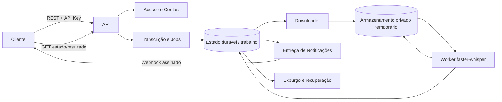

# TechSpec — API assíncrona de transcrição

> **Escopo:** Backend
> **Modo:** API-First
> **PRD de origem:** `tasks/prd-api-transcricao-assincrona/prd.md` (v1.0, aprovado)
> **Contratos de integração:** `contracts.md` e `api-contract.yaml` (OpenAPI 3.1.0, v1.0.0; em revisão)
> **Data:** 2026-09-28
> **Status:** Aprovado
> **Handoff:** approved — pode alimentar o Task Creator

## Resumo Executivo

A feature evolui a PoC local para uma API de máquina a máquina que autentica uma conta, aceita uma solicitação idempotente, obtém a mídia sem manter a conexão HTTP aberta durante a transcrição, informa o ciclo de vida, envia um webhook terminal e disponibiliza o resultado versionado durante a retenção.

A direção arquitetural herdada do baseline aprovado é um monólito modular com fronteiras de Acesso e Contas, Transcrição e Jobs e Entrega de Notificações. O runtime permanece Python/FastAPI, como na aplicação atual. O serviço adiciona PostgreSQL para estado durável, com migrations Alembic desde a primeira tabela; jobs entram em migration posterior. API, aquisição de mídia, inferência, entrega e expurgo podem executar em papéis de processo distintos, sem introduzir um serviço por domínio. O armazenamento temporário desta feature usará um bucket privado S3, conforme ADR-001.

A integração permanece HTTP: as chamadas do cliente, consultas e webhook terminal pertencem ao OpenAPI deste PRD. AsyncAPI e ODCS não se aplicam ao conjunto atual. O adaptador local `faster-whisper` pode continuar sendo o motor interno; a interface pública permanece independente dele e retorna o JSON `schemaVersion: 1`.

O trade-off herdado da fila durável no banco é reduzir componentes e manter próximo o registro do job e a reivindicação do trabalho, ao custo de não ter as capacidades próprias de vazão, fan-out e isolamento operacional de um broker. O baseline condiciona a introdução de broker a evidência de necessidade. Usar S3 atende à separação entre metadados e objetos privados, com o custo de configurar credenciais, expurgo e limpeza de órfãos fora do banco.

## Arquitetura da Solução

### Diagrama

O diagrama expressa papéis e propriedade lógica, não processos ou tecnologia de banco. O bucket privado S3 guarda mídia temporária e resultados, com separação lógica por prefixo; metadados e estado permanecem no banco. O downloader deve ter capacidade independente da inferência para que workers ocupados não impeçam o início de downloads novos.

### Bloco Backend

- **Acesso e Contas** autentica API Keys, resolve conta e `credential_id`, aplica o conjunto inicial de permissões igual para todas as chaves e protege leituras tanto por conta quanto pela credencial criadora. Não administra jobs nem resultados.
- **Transcrição e Jobs** é dono do estado de ciclo de vida, referência de origem enquanto necessária, resultado e política de retenção. Ele aceita a solicitação somente depois de registrar estado suficiente para recuperação. O agendamento precisa sobreviver a reinício do processo.
- **Aquisição de mídia** valida a URL HTTPS não confiável a cada tentativa, incluindo DNS e redirecionamentos; bloqueia loopback, redes privadas, link-local e destinos de metadados; restringe a saída de rede; aplica 10 s para conexão, 60 s de inatividade de leitura e até 5 GiB por arquivo. Conforme Q-04 aprovado, faz até 3 tentativas totais para falhas transitórias, dentro da validade da URL. A URL não é devolvida ao cliente e deixa de ser necessária após a aquisição bem-sucedida.
- **Inferência** reivindica trabalho baixado, lê a mídia privada e chama o adaptador de transcrição. A mídia deve avançar de `downloading` para `queued`, depois `processing` e terminar em `completed` ou `failed`. Falhas públicas usam apenas os códigos e resumos seguros do contrato.
- **Entrega de Notificações** recebe o fato terminal e o contexto mínimo, carrega destino e material de assinatura vinculados à conta e gerencia suas tentativas independentemente do estado do job. O evento é ao menos uma vez e mantém `eventId` estável nas tentativas.
- **Expurgo e recuperação** retomam leases expirados, removem mídia quando deixa de ser necessária, removem resultado e metadados após até 24 horas do estado terminal e identificam temporários órfãos no S3; a garantia contra versões antigas ou cópias imutáveis fica definida na ADR-001.
- A primeira fase não terá API nem interface administrativa. O operador provisiona e revoga chaves e configura o destino do webhook fora da API pública, conforme o PRD; EN-02 registra esse procedimento operacional para o piloto. O contrato da API administrativa fica para a segunda fase, e sua interface virá depois.

### Fluxo de dados sensíveis e credenciais transitórias

| Dado | Criação, cópia e persistência | Leitura e descarte |
|---|---|---|
| API Key do cliente | O segredo é provisionado e apresentado uma única vez. A API recebe-o por TLS; somente verificador/hash e metadados são persistidos. Todas as chaves têm as mesmas operações: criar jobs e ler estado/resultado dos jobs criados pela própria chave. | `X-API-Key` identifica conta e `credential_id`; cada leitura verifica ambos. O segredo em claro não aparece em logs, traces ou erros. Na rotação, o novo segredo mantém o `credential_id` e o acesso aos jobs existentes; a chave antiga deixa de autorizar chamadas. |
| URL assinada (`sourceUrl`) | O code-for-coders gera uma URL HTTPS pré-assinada de leitura (GET) para seu objeto privado e a envia no corpo HTTPS de `createTranscription`, pouco antes da chamada. Q-04 aprovado exige validade efetiva mínima de 60 min desde a emissão. Se a retomada do download exigir a URL, qualquer cópia durável fica protegida em repouso e limitada às tentativas aprovadas. A impressão digital de idempotência de 120 segundos não guarda nem registra a URL em claro. | Somente o downloader autorizado lê a URL. Ela não entra em resposta, webhook, log, trace, métrica ou mensagem de erro. Apagar após download bem-sucedido ou encerramento das tentativas. A API recebe apenas a URL, nunca credenciais do bucket do consumidor. |
| Mídia baixada | Copiada da origem para o bucket privado S3 controlado pelo Whisper, com criptografia em trânsito e em repouso. O consumidor não fornece credenciais do bucket. A configuração local fica em `.env` ignorado pelo Git; nomes de variáveis e valores de produção serão definidos na implementação. | Lida pelo worker de transcrição. Remover assim que não for mais necessária e, no máximo, no fim da retenção terminal de 24 horas; limpeza periódica também localiza órfãos. O bucket temporário não deve reter versões antigas ou objetos protegidos por Object Lock além desta política. |
| Resultado da transcrição | Gerado pelo motor, convertido para o formato público v1 e persistido no bucket privado S3, separado dos metadados no banco. Só é publicado após sucesso completo. | Lido pela operação autenticada de resultado, após autorização por conta e `credential_id`; não é enviado no webhook. Expurgar até 24 horas após `terminalAt`. |
| Segredo/material de assinatura do webhook | O operador cadastra ou rotaciona material independente da API Key, protegido em armazenamento de segredos. Standard Webhooks v1 usa HMAC-SHA256, timestamp com tolerância de ±300 s e retries por até 72 h. | Apenas Entrega de Notificações lê o material para assinar avisos. Não registrar nem incluir em payload. Em rotação planejada, aceitar assinatura antiga e nova por 72 h; em comprometimento, revogar imediatamente a antiga. |
| Evento de webhook | Produzido na transição terminal, com `eventId`, `jobId`, estado e `clientReference` se enviada. Standard Webhooks v1 usa `webhook-id`, `webhook-timestamp` e `webhook-signature`, assinando o ID, timestamp por tentativa e corpo JSON exato. | Entregue ao destino configurado para a conta. `eventId` permanece estável entre retries; 2xx encerra entrega, 3xx falha sem redirecionamento, 410 desativa o destino e 429 aplica redução de ritmo; considerar `Retry-After`. |

### Mapeamento do contrato de API

O OpenAPI do PRD é a fonte dos schemas, parâmetros e respostas; esta tabela registra as fronteiras de implementação sem duplicar esses schemas. A rota existente da PoC é apenas referência local: não foi encontrada evidência de contrato ou implantação de produção.

| operationId | Caminho de implementação |
|---|---|
| `createTranscription` | Adaptador HTTP existente em `app/api/transcriptions.py` → validação de `X-API-Key` e `credential_id` → caso de uso de Transcrição e Jobs → registro idempotente durável no escopo da chave por 120 segundos → downloader. Responder `202` depois que a aquisição assumir o job e iniciar a conexão. |
| `getTranscription` | `app/api/transcriptions.py` → consulta de estado em Transcrição e Jobs, escopada pela conta e pelo `credential_id` autenticados; job de outra conta, outra chave ou expirado retorna `404 NOT_FOUND` neutro. |
| `getTranscriptionResult` | Adaptador HTTP → autorização pela conta e pelo `credential_id` proprietários → leitura privada do resultado concluído e ainda retido. Sem resultado parcial; estado não concluído/failed retorna `409 RESULT_NOT_AVAILABLE`; expirado retorna `404`. |
| `receiveTranscriptionTerminalWebhook` | É o identificador do contrato de webhook enviado pelo Whisper, não um endpoint de entrada na API Whisper. Transição terminal → Entrega de Notificações → destino cadastrado. Standard Webhooks v1 adotado; retentativas preservam `webhook-id`/`eventId` e atualizam o timestamp assinado. |

**Validações além do contrato:**

| operationId / etapa | Regra | Camada |
|---|---|---|
| `createTranscription` | Validar destino, DNS e cada redirecionamento da URL, impedir acesso a redes internas e aplicar os limites de 5 GiB e a política de validade/tentativas aprovada em Q-04. | Entrada / adaptador de origem |
| `createTranscription` e aquisição | Escopar idempotência por conta, `credential_id` e `Idempotency-Key`, retida por 120 segundos a partir do primeiro aceite. Dentro da janela, o mesmo JSON semântico retorna o mesmo job; propriedades JSON podem vir em ordem/whitespace diferentes, mas valores, incluindo `sourceUrl`, devem ser iguais. Reuso com corpo diferente é `409 IDEMPOTENCY_KEY_REUSED`; depois de 120 segundos a chave pode iniciar novo job. | Transcrição e Jobs |
| Aquisição de mídia | Aplicar máximo de 5 GiB e extensões iniciais já vistas na PoC (`.mp4`, `.mkv`, `.webm`, `.mp3`, `.wav`, `.m4a`), com validação real de formato/codec. Tamanho conhecido e inspecionável no início da conexão (por exemplo, `Content-Length`) acima do limite é rejeitado antes do aceite, com HTTP 413 `MEDIA_SIZE_LIMIT_EXCEEDED` e sem criar job. Se o tamanho não for conhecido/inspecionável no início da conexão (por exemplo, transferência chunked), aplicar o limite durante o streaming; se o total exceder 5 GiB, o job já aceito termina em `failed/MEDIA_SIZE_LIMIT_EXCEEDED`. | Transcrição e Jobs / contrato |
| Aquisição de mídia | Conforme Q-04 aprovado, usar URL de leitura com validade efetiva mínima de 60 min desde a emissão, incluindo validade suficiente das credenciais temporárias que a assinam. O S3 verifica a expiração no início de cada request: download já iniciado pode terminar depois dela, mas uma retomada iniciada depois da expiração falha ([documentação AWS](https://docs.aws.amazon.com/AmazonS3/latest/userguide/using-presigned-url.html)). Usar timeout de conexão de 10 s e timeout de inatividade de leitura de 60 s (não é duração total do download); fazer até 3 tentativas totais e, nas duas retentativas, aplicar full jitter com espera de 0–5 s e 0–30 s, somente para falhas transitórias de rede, timeout, HTTP 408/429/5xx. Respeitar `Retry-After` quando enviado, desde que uma nova tentativa ainda possa começar antes do vencimento da URL. Não repetir falhas permanentes, incluindo URL inválida/expirada ou HTTP 4xx diferente de 408/429. Se a origem continuar indisponível, terminar em `failed/SOURCE_UNAVAILABLE`; não renovar nem solicitar nova URL automaticamente. Para novo processamento após essa falha, o consumidor deve gerar outra URL e enviar uma nova solicitação com nova `Idempotency-Key`. | Transcrição e Jobs / contrato |
| Inferência e publicação do resultado | Rejeitar mídia acima de duas horas com `MEDIA_DURATION_LIMIT_EXCEEDED`; converter idioma interno `pt` para `pt-BR`, duração e timestamps internos para milissegundos relativos ao início e segmentos para o schema público v1. | Transcrição e Jobs / adaptador do motor |
| `getTranscription`, `getTranscriptionResult` | Autorização por conta e chave criadora é obrigatória em cada leitura. IDs opacos não substituem essa verificação; outra conta ou chave recebe resposta neutra sem distinção de existência. | Acesso e Contas + Transcrição e Jobs |
| Webhook terminal | URL do callback vem da configuração do operador, nunca do job. Exigir HTTPS e proteção contra acesso a destinos internos. Standard Webhooks v1 assina `webhook-id + "." + webhook-timestamp + "." + raw_body` com HMAC-SHA256; conferir assinatura em tempo constante, aplicar tolerância de ±300 s e deduplicar por ID por 72 h. | Entrega de Notificações |

**Exceção → resposta HTTP:**

| Situação | HTTP | code do contrato |
|---|---:|---|
| Corpo JSON malformado ou campo obrigatório ausente | 400 | `INVALID_REQUEST` |
| API Key ausente, inválida ou revogada | 401 | `UNAUTHORIZED` |
| API Key válida sem permissão (reservado para permissões futuras, fora do primeiro corte) | 403 | `FORBIDDEN` |
| Job inexistente, expirado, de outra conta ou criado por outra chave | 404 | `NOT_FOUND` |
| Chave de idempotência reutilizada para payload diferente | 409 | `IDEMPOTENCY_KEY_REUSED` |
| Tamanho conhecido e inspecionável acima de 5 GiB, detectado antes do aceite | 413 | `MEDIA_SIZE_LIMIT_EXCEEDED` (sem job) |
| Excesso acima de 5 GiB detectado durante o streaming após o aceite | — (falha assíncrona) | `failed/MEDIA_SIZE_LIMIT_EXCEEDED` |
| Resultado ainda indisponível ou job failed | 409 | `RESULT_NOT_AVAILABLE` |
| URL fora do contrato (por exemplo, não HTTPS) | 422 | `INVALID_SOURCE_URL` |
| Falha inesperada | 500 | `INTERNAL_ERROR` |

Erros públicos seguem Problem Details RFC 9457; nenhuma resposta inclui stack trace, URL assinada, credencial ou detalhe interno do provedor.

**URI de consulta:** não há navegação de navegador nesta feature. `Location` e `statusUrl` do OpenAPI são referências relativas sob `/v1/transcriptions/{jobId}`, resolvidas contra a origem HTTPS usada pelo cliente. O OpenAPI deixa o host e ambiente para a implantação; não foi encontrada uma origem pública completa no workspace, portanto esta TechSpec não inventa domínio ou porta.

### Interfaces entre fatias ou times

- Contrato cliente → Whisper: `tasks/prd-api-transcricao-assincrona/api-contract.yaml`, operações listadas acima, estado público e respostas RFC 9457.
- Contrato Whisper → primeiro consumidor: `transcriptionTerminal` no mesmo OpenAPI. O serviço entrega ao menos uma vez; o consumidor valida assinatura e deduplica pelo `eventId`.
- O contrato de integração precisa documentar como o code-for-coders gera e envia a URL de leitura, sua validade e as responsabilidades de ambos os lados. Q-03 e Q-04 estão aprovados; EN-01 publica o fluxo e EN-03 atualiza o OpenAPI antes da integração ponta a ponta.
- A API administrativa para contas, API Keys e destinos de webhook fica para a segunda fase; seu contrato será separado do OpenAPI público e o frontend virá depois. Na primeira fase, EN-02 documenta o procedimento do operador fora da API pública.

## Mapa de Fatias Verticais

Todas as fatias são backend e preservam as fronteiras de domínio do Domain Map. Os checkpoints abaixo descrevem evidência requerida na implementação; nenhuma execução de teste foi realizada nesta etapa.

### V-01: Chamada autenticada e isolada por conta

- **Cobre:** RF-01; autorização requerida por RF-02, RF-03 e RF-05.
- **Entrada / gatilho:** Operador provisiona/rotaciona/revoga credencial; todas recebem as mesmas operações iniciais, e o cliente chama REST com `X-API-Key`.
- **Processamento:** Provisionamento mostra o segredo apenas uma vez e persiste somente verificador/hash e metadados. Todas as chaves têm as mesmas permissões iniciais para criar jobs e consultar estado/resultado somente dos jobs criados com aquela credencial. Cada chamada resolve conta e `credential_id`; job de outra conta ou chave resulta em `404` neutro.
- **Saída observável:** Operações autorizadas atuam sob uma conta e uma credencial; chave inválida/revogada recebe `401`; consultas por outra conta ou chave não revelam existência. Metadados operacionais mostram criação, permissões iniciais, último uso e revogação, sem recuperar segredo. `403` permanece para futuras permissões diferenciadas, fora do primeiro corte.
- **Arquivos:** `app/api/transcriptions.py`, `app/main.py`, `app/jobs/executor.py`.
- **Teste / evidência / checkpoint:** Cenários de provisionamento/entrega única, chave armazenada sem segredo em claro, revogação, acesso cruzado entre contas e entre chaves da mesma conta com resposta neutra. Na rotação, segredo antigo falha e novo segredo com o mesmo `credential_id` mantém acesso aos jobs existentes.
- **Bloqueado por:** EN-02 (procedimento operacional do piloto) e EN-03 (alinhamento do OpenAPI público). `X-API-Key`, permissões iniciais e política de rotação foram definidos.

### V-02: Criar job sem aguardar transcrição e repetir com segurança

- **Cobre:** RF-02; início de RF-03.
- **Entrada / gatilho:** `POST /v1/transcriptions` autenticado, com `sourceUrl`, `Idempotency-Key` e `clientReference` opcional.
- **Processamento:** Confirmar chave ativa, persistir job e vínculo de idempotência por conta + `credential_id` + chave por 120 segundos e iniciar a conexão de download antes de responder. Repetição semanticamente igual dentro da janela retorna o mesmo job; corpo diferente retorna `409` e não substitui o original. URL nunca retorna em resposta. O consumidor deve criar a URL pré-assinada de leitura pouco antes da chamada; a validade e as tentativas seguem a política aprovada em Q-04.
- **Saída observável:** `202 Accepted` com job opaco em `downloading`, referência de consulta e horários requeridos no OpenAPI; requisição repetida não cria outro processamento.
- **Arquivos:** `app/api/transcriptions.py`, `app/jobs/executor.py`, `app/main.py`, `app/transcription/paths.py`.
- **Teste / evidência / checkpoint:** Requisição válida retorna após início da conexão; perda simulada da resposta seguida da repetição retorna o mesmo job; payload conflitante recebe `409`; reinício do processo não perde o job aceito.
- **Bloqueado por:** V-01, EN-01 (documentação de integração) e EN-03 (atualização do contrato OpenAPI). A janela de idempotência está definida em 120 segundos e a política de aquisição foi aprovada em Q-04.

### V-03: Adquirir, validar e transcrever a mídia até estado terminal

- **Cobre:** RF-02 (falha de origem e duração), RF-03 e parte de RF-06.
- **Entrada / gatilho:** Job durável em `downloading`; conexão com origem HTTPS assinada.
- **Processamento:** Downloader valida destino/DNS/redirecionamento, limita downloads simultâneos globais a 2 e grava no bucket privado S3; não espera capacidade de inferência. Conforme Q-04 aprovado, a URL tem validade mínima de 60 min desde a emissão, timeout de conexão de até 10 s, leitura sem progresso por até 60 s e 3 tentativas totais; as duas retentativas usam full jitter com espera de 0–5 s e 0–30 s para falhas transitórias. Não repetir erro permanente nem começar tentativa após expiração; não renovar a URL automaticamente. Para novo processamento após falha da origem, o consumidor gera outra URL e envia nova solicitação com nova chave de idempotência. O worker de inferência permanece serial no piloto. Após aquisição bem-sucedida, descarta a URL quando não houver tentativa pendente e avança para `queued`. Worker separado reivindica o job, chama o adaptador local e avança para `processing`. Falha de origem após esgotar tentativas termina em `failed/SOURCE_UNAVAILABLE`; mídia acima de duas horas termina em `failed/MEDIA_DURATION_LIMIT_EXCEEDED`; mídia acima de 5 GiB usa `MEDIA_SIZE_LIMIT_EXCEEDED`; formato incompatível usa `UNSUPPORTED_MEDIA_FORMAT`. Somente sucesso completo produz resultado e `completed`. Atualizações de estado e leases permitem retomada segura após reinício e não iniciam transcrição duplicada.
- **Saída observável:** `getTranscription` expõe `downloading → queued → processing → completed|failed`, horários disponíveis e resumo de falha seguro. Q-02 aprovou como alvo inicial p95 de até 30 s da chegada da requisição à primeira conexão bem-sucedida com a origem e p95 de até 24 h desde `acceptedAt` até estado terminal, para no máximo 10 jobs/dia, cada um com até 2 h e 5 GiB. Reavaliar esses SLOs com métricas de produção assistida.
- **Arquivos:** `app/jobs/executor.py`, `app/main.py`, `app/service.py`, `app/transcription/paths.py`, `app/monitoring/metrics.py`, `docker-compose.yml`.
- **Teste / evidência / checkpoint:** Origem de teste acessível pelo worker; ciclo completo observável por consulta; falha transitória é repetida no máximo duas vezes, enquanto URL expirada/falha permanente termina sem inferência; SSRF bloqueia loopback, redes privadas, link-local, metadados e redirecionamento para destinos bloqueados; limite de duração e formato geram estado terminal correto; carga de inferência ocupada não posterga downloads além do SLO aprovado; leases recuperam job após encerramento abrupto.
- **Bloqueado por:** V-02, EN-01 (documentação do consumidor) e EN-03 (contrato atualizado). Os limites, SLO iniciais e política de aquisição foram aprovados; o backend S3 foi escolhido.

### V-04: Consultar resultado versionado e expurgar dados no prazo

- **Cobre:** RF-05 e RF-06.
- **Entrada / gatilho:** Cliente autenticado consulta estado ou chama `GET /v1/transcriptions/{jobId}/result`; rotina de expurgo identifica item vencido ou temporário órfão.
- **Processamento:** Estado e resultado sempre verificam conta e `credential_id` proprietários. Resultado só é servido para job `completed` durante até 24 horas depois de `terminalAt`; job não concluído ou `failed` não entrega parcial. Resultado contém `schemaVersion: 1`, `pt-BR`, duração e segmentos em milissegundos. Remover mídia tão logo não seja mais necessária; expurgar resultado e metadados no prazo e encontrar órfãos no bucket S3.
- **Saída observável:** `200` com JSON v1 para resultado disponível; `409 RESULT_NOT_AVAILABLE` antes de sucesso ou em falha; `404 NOT_FOUND` para expirado ou de outra conta/chave. Após expurgo, nenhum conteúdo continua acessível.
- **Arquivos:** `app/api/transcriptions.py`, `app/jobs/executor.py`, `app/service.py`, `app/monitoring/metrics.py`, `docker-compose.yml`.
- **Teste / evidência / checkpoint:** Resultado validado contra o schema, timestamps relativos; job de outra conta, outra chave ou expirado não expõe conteúdo; fronteira da janela de 24 horas; job failed sem resultado parcial; mídia removida após uso; temporário órfão identificado e apagado. Smoke requer banco e bucket S3 privados isolados e configurados, migrations/seeds reproduzíveis e conta/chave de teste.
- **Bloqueado por:** V-01, V-03 e EN-03.

### V-05: Entregar aviso terminal assinado sem alterar o job

- **Cobre:** RF-04.
- **Entrada / gatilho:** Job muda para `completed` ou `failed` e a conta tem destino de webhook configurado.
- **Processamento:** Criar evento terminal durável com ID estável e payload mínimo; Standard Webhooks v1 assina o ID, timestamp renovado por tentativa e corpo JSON exato com HMAC-SHA256; enviar ao destino provisionado; persistir tentativas separadas do estado do job. Repetir falhas transitórias por até 72 h com backoff exponencial e jitter. Respeitar os códigos de resposta aprovados; rotação planejada assina com os dois segredos por 72 h e comprometimento exige revogação imediata. A rotação do webhook não depende da API Key.
- **Saída observável:** Cliente recebe aviso deduplicável com estado terminal e referência opcional; payload não carrega mídia ou transcrição. Falha definitiva fica visível como estado da entrega para operação, sem reverter job.
- **Arquivos:** `app/jobs/executor.py`, `app/main.py`, `app/monitoring/metrics.py`, `docker-compose.yml`.
- **Teste / evidência / checkpoint:** Receptor de webhook verifica os headers Standard Webhooks sobre o corpo exato; resposta 2xx encerra entrega; falha transitória seguida de sucesso preserva `webhook-id` e atualiza timestamp; falha definitiva preserva `completed`/`failed`; replay fora da tolerância aprovada é rejeitado/detectado. Pré-requisito: destino/receptor HTTPS isolado, configuração de conta de teste e material de assinatura de teste provisionado.
- **Bloqueado por:** V-01, V-03, EN-02 e EN-03.

### Habilitadores inevitáveis

| Habilitador | Por que não cabe numa fatia | Menor escopo | Primeira fatia desbloqueada |
|---|---|---|---|
| EN-01 — Documentação de integração do consumidor | Registra o acordo entre produtos e orienta o consumidor, sem produzir comportamento no backend Whisper. | Instruções para `X-API-Key`, criação/idempotência, geração pelo code-for-coders da URL pré-assinada de leitura conforme Q-03, validade e tentativas de download conforme Q-04, consulta/resultado e verificação/deduplicação do webhook; publicar alinhada ao contrato OpenAPI. | V-02 e piloto ponta a ponta |
| EN-02 — Procedimento operacional do piloto | Registra como operador executa tarefas fora da API pública na primeira fase, sem criar comportamento do produto. | Runbook para provisionar/entregar/revogar API Keys e configurar destino/segredo do webhook com auditoria mínima. O contrato da API administrativa é da fase 2; frontend depois. | V-01 e V-05 no piloto |
| EN-03 — Atualização e aprovação dos contratos públicos | OpenAPI e índice descrevem o acordo público consumido pelo primeiro cliente, sem entregar comportamento do backend. | Atualizar `api-contract.yaml`, `api-contract.md` e `contracts.md` para `X-API-Key`, 120 s de idempotência, autorização por chave criadora, limite de 5 GiB, política inicial aprovada de validade/tentativas de aquisição e headers Standard Webhooks; sincronizar o critério de scopes do RF-01 com permissões iniciais iguais e incluir SLO/formatos e política de webhook já aprovados. | V-01, V-02, V-03 e V-05 |

## Arquivos a Modificar e a Referenciar

### A modificar

| Caminho | Fatia | Alteração |
|---|---|---|
| `app/api/transcriptions.py` | V-01, V-02, V-04 | Evoluir fachada REST local para contrato API-first, autenticação, autorização por chave criadora, criação e consultas públicas seguras. |
| `app/jobs/executor.py` | V-02, V-03, V-05 | Substituir estado/fila somente em memória pelo fluxo de trabalho durável e recuperável, respeitando propriedade de domínio. |
| `app/main.py` | V-01 a V-05 | Integrar ciclo de vida e papéis de execução necessários após as decisões de runtime e armazenamento. |
| `app/service.py` | V-03, V-04 | Integrar aquisição/processamento ao resultado temporário JSON v1; manter falhas públicas categorizadas e resumo seguro. |
| `app/transcription/paths.py` | V-02, V-03 | A entrada atual é um caminho local; integrar a nova fronteira de URL remota com validação de destino e mídia aprovada. |
| `app/monitoring/metrics.py` | V-02, V-03, V-05 | Medir início de download, idade/tamanho de fila, falhas por etapa e tentativas/atraso de notificação sem atributos sensíveis. |
| `docker-compose.yml` | V-02 a V-05 | Reproduzir papéis e dependências locais para smoke após escolher runtime, banco e armazenamento; preservar isolamento de recursos de teste. |
| `.env.example` | V-03, V-04 | Documentar nomes/placeholders para bucket S3 e configuração local sem incluir credenciais reais; o usuário manterá valores locais no `.env` ignorado. |

### A referenciar (não alterar nesta feature)

| Caminho | Por que consultar |
|---|---|
| `tasks/prd-api-transcricao-assincrona/prd.md` | Requisitos RF-01 a RF-06, premissas do piloto e critérios de aceite. |
| `tasks/prd-api-transcricao-assincrona/contracts.md` | Participantes, histórico, dependência do consumidor e pendências que mantêm o acordo em revisão. |
| `tasks/prd-api-transcricao-assincrona/api-contract.yaml` | Schemas, `operationId`s, respostas e payload de webhook que a implementação deve cumprir. |
| `context/architecture-baseline.md` | Fronteiras, job durável, recuperação, isolamento de capacidade, segurança e observabilidade; aprovado pelo usuário em Q-09. |
| `context/domain-map.md` | Propriedade de Acesso e Contas, Transcrição e Jobs e Entrega de Notificações. |
| `../../docs/adr/index.md` | Índice global das decisões aceitas que complementam o baseline para esta feature. |
| `app/transcription/whisper.py` e `app/transcription/models.py` | Adaptador atual e segmentos internos independentes do motor; mapear para o resultado público sem expor tipos do fornecedor. |
| `README.md` e `docs/plano-api-transcricao.md` | Fluxo local da PoC e origem do recorte de produto; não provam contrato de produção. |
| `../../docs/adr/adr-001.md` e `../../docs/adr/adr-002.md` | ADRs aceitas registram o bucket S3 privado e o formato/política operacional Standard Webhooks v1. |

## Análise de Impacto

| Componente | Tipo | Impacto e risco | Ação requerida |
|---|---|---|---|
| API da PoC (`POST/GET /v1/transcriptions`) | Modificado | A rota de criação existente recebe caminho de arquivo e retorna estado em memória; o novo contrato exige URL, conta, idempotência e resultado separado. Não há evidência de versão em produção nem compatibilidade a preservar. | Implementar o OpenAPI v1 do PRD; não tratar a interface de PoC como contrato publicado. |
| Ingestão e inferência | Modificado | Há um executor serial único; download e processamento compartilham caminho de execução. Mídias longas podem atrasar a ingestão de novos jobs. | Separar capacidade do downloader e da inferência, com fila/estado duráveis conforme baseline. |
| Persistência de mídia e resultado | Novo comportamento | A PoC usa volumes locais; a feature usará bucket privado S3. Versionamento, Object Lock, lifecycle e permissões podem reter cópias ou impedir remoção dentro da política. | Aplicar a ADR-001, manter bucket privado sem retenção imutável incompatível, configurar acesso mínimo e validar expurgo antes do smoke. |
| Primeiro consumidor code-for-coders | Integração externa pendente | O contrato consultado oferece URLs assinadas de escrita, não de leitura. A decisão Q-03 define que o consumidor gere URL pré-assinada GET para seu objeto privado e envie `sourceUrl`; é necessário implementar/documentar esse fluxo no consumidor. | Adotar a validade e política de tentativas aprovadas em Q-04 e registrá-las na documentação EN-01 antes do piloto integrado. |
| Operação de contas e callbacks | Integração operacional na fase 1; contrato administrativo na fase 2 | O OpenAPI público não administra API Keys nem destinos; o PRD delega essas ações ao operador. | Documentar o procedimento manual de provisionamento no EN-02 para o piloto; planejar contrato administrativo na fase 2 e frontend depois. |
| Capacidade inicial | Operação/benchmark | Dez jobs por dia de até duas horas podem somar vinte horas de mídia; RTF e pico simultâneo ainda precisam de evidência de produção. | Q-02 aprovou limites/SLO iniciais; calibrar esses alvos durante produção assistida antes de firmar compromisso externo. |

## Riscos e Preocupações

| Preocupação | Local (`arquivo:linha`) | Impacto | Mitigação |
|---|---|---|---|
| Estado de jobs e fila existem apenas em memória e há um único executor de transcrição. | `app/jobs/executor.py:22-28`; `app/main.py:55` | Reinício perde jobs/status e processamento longo pode impedir início oportuno de download. | Usar estado durável, leases/retomada e capacidade separada de download e inferência conforme baseline; cobrir reinício abrupto no checkpoint V-03. |
| Rotas da PoC não autenticam nem isolam consultas por conta. | `app/api/transcriptions.py:19-45` | A evolução pode revelar job ou resultado entre clientes se uma validação ficar fora de alguma consulta. | Autenticar cada operação e filtrar por conta no servidor; respostas neutras para conta alheia; cenários de acesso cruzado em V-01/V-04. |
| Entrada atual valida caminho local, não URL de rede. | `app/transcription/paths.py:10-40` | Aceitar URL sem nova defesa cria risco de SSRF, redirecionamento a redes privadas ou downloads sem limite. | Aplicar regras SSRF do baseline em cada resolução e redirecionamento, restringir saída do worker e aplicar limite de 5 GiB e política de validade/tentativas aprovada em Q-04. |
| Serviço grava artefatos no diretório de saída e não aplica retenção terminal. | `app/service.py:99-105`, `app/service.py:113-127` | Mídia/resultado podem permanecer localmente além da janela; versionamento, Object Lock ou replicação no bucket também poderiam manter cópias. | Persistir no bucket privado S3, remover mídia após uso, apagar objetos expirados e impedir política de retenção imutável incompatível; registrar expurgo e limpar órfãos. |
| Worker registra traceback completo em falha. | `app/jobs/executor.py:66-68` | Bibliotecas de rede/armazenamento podem incluir URL assinada ou dado de origem na exceção no fluxo novo. | Classificar falha para cliente; sanitizar/redigir URL e conteúdo antes de logar; manter correlação por job e categoria segura. |
| Não foram encontrados testes no workspace para as rotas, jobs e segurança que a feature altera. | `app/api/transcriptions.py:19-45`; `app/jobs/executor.py:22-84` | Regressões de autorização, repetição, retomada e expurgo podem escapar da verificação. | Implementar cenários de integração por fatia e evidências de contrato; gate de infraestrutura deve usar ambiente reproduzível e isolado. |

## Verificação

- **Cenários críticos não óbvios:** Repetição concorrente da mesma chave; requisição de payload conflitante; reinício entre persistência e início do worker; lease expirado; URL que muda destino por DNS/redirecionamento; concorrência de download com inferência; falha de callback sem mutar job; expiração e consulta exatamente na borda da retenção; autorização cruzada em estado e resultado.
- **Dados ou ambiente especiais:** Ambiente de integração com bucket privado S3, configuração/migrations reproduzíveis, isolamento por execução, conta e API Key de teste, origem HTTPS controlada que ofereça URL de leitura assinada, receptor HTTPS de webhook e relógio controlável para testar retenção/backoff. Não reutilizar buckets, tabelas, chaves ou filas compartilhados de outro produto. Configurar permissões mínimas e limpeza de objetos/versionamento; URL assinada e mídia fixture devem ser descartáveis e ausentes de logs. Credenciais locais entram em `.env`, nunca em `.env.example` ou Git.
- **Observabilidade além do padrão:** Medir separadamente tempo até início da conexão de download, idade/tamanho de filas, duração/RTF de inferência, falhas por estágio, expurgo atrasado, retries/atraso de callback e uso de recurso. Contexto entre requisição e worker deve persistir apenas IDs e informação mínima; nenhuma URL, mídia, transcrição ou credencial como atributo.
- **Verificação dos contratos:** EN-03 atualiza/aprova OpenAPI e índice de contratos para `X-API-Key`, retenção idempotente de 120 s, acesso por credencial criadora, limite de 5 GiB, política aprovada de validade/tentativas de aquisição, headers Standard Webhooks e política de retries/rotação. Verificar 202 somente após início da aquisição; respostas RFC 9457; isolamento entre contas/chaves; repetição dentro e fora dos 120 s; assinatura sobre corpo exato e deduplicação estável; resultado v1 e retenção. O lint do YAML já registrado em `contracts.md` valida estrutura, não comportamento, produção ou compatibilidade.
- **Critério de início do piloto:** Implementar no code-for-coders a geração da URL de leitura definida em Q-03, aplicar a política de validade/tentativas aprovada em Q-04, validar capacidade por benchmark, documentar procedimento do operador em EN-02 e concluir EN-01/EN-03 para a integração ponta a ponta. A API administrativa e seu frontend ficam para a fase 2.

## Pendências para Handoff

As decisões materiais estão aprovadas, incluindo Q-04: validade efetiva mínima da URL de leitura de 60 min, timeouts de 10 s para conexão e 60 s sem progresso de leitura, e até 3 tentativas totais para falhas transitórias. Permanecem tarefas de integração antes do piloto, sem bloquear o handoff ao Task Creator: EN-01 documenta e implementa o acordo com o consumidor; EN-02 registra o procedimento operacional da primeira fase; EN-03 atualiza e aprova os contratos públicos; V-03 valida a capacidade por benchmark. A API administrativa e seu frontend ficam para a segunda fase.

- [x] **Q-03 — URL de leitura do consumidor:** o code-for-coders gera uma URL HTTPS pré-assinada de leitura (GET) para o objeto privado e a envia como `sourceUrl`; o consumidor não compartilha credenciais do bucket. Implementar/documentar o fluxo pelo EN-01 — **produto/plataforma**.
- [x] **Q-04 — Download:** URL válida por no mínimo 60 min desde a emissão, incluindo a validade das credenciais temporárias; timeout de conexão de 10 s e inatividade de leitura de 60 s; até 3 tentativas totais (inicial + 2 retries), com full jitter e esperas de 0–5 s e 0–30 s para falhas transitórias de rede, timeout, HTTP 408/429/5xx; respeitar `Retry-After` se a retentativa ainda puder iniciar antes da expiração; não repetir falhas permanentes nem iniciar tentativa depois do vencimento. S3 verifica a validade no início do request: um download em andamento pode terminar depois do vencimento, mas uma retomada posterior falha ([documentação AWS](https://docs.aws.amazon.com/AmazonS3/latest/userguide/using-presigned-url.html)). Ao esgotar tentativas, marcar `failed/SOURCE_UNAVAILABLE`, sem renovar a URL; para novo processamento, consumidor emite outra URL e usa nova `Idempotency-Key`. Os timeouts não limitam a duração total de um download que continue progredindo.

Decisões resolvidas: Q-01 bucket privado S3; Q-02 limites/SLO iniciais aprovados; Q-03 URL de leitura emitida pelo consumidor; Q-04 validade/tentativas iniciais aprovadas; Q-05 Standard Webhooks v1 e política operacional aprovados; Q-06 idempotência por 120 s; Q-07 `X-API-Key`; Q-08 contrato da API administrativa na fase 2, frontend depois, com operador fora da API pública na primeira fase; Q-09 baseline aprovado; Q-10 permissões iguais e leitura apenas dos jobs da própria chave; Q-11 rotação conserva o `credential_id` e acesso aos jobs existentes.

## Architecture Decision Records

ADRs afetadas: [ADR-001 — Armazenamento temporário em bucket privado S3](../../docs/adr/adr-001.md) (`Accepted`, escolha explícita em Q-01) e [ADR-002 — Assinatura de webhook no padrão Standard Webhooks](../../docs/adr/adr-002.md) (`Accepted`, adoção pesquisada conforme Q-05). Nenhuma ADR anterior própria do Whisper foi encontrada. O baseline permanece como direção aprovada, sem decidir runtime ou banco.
